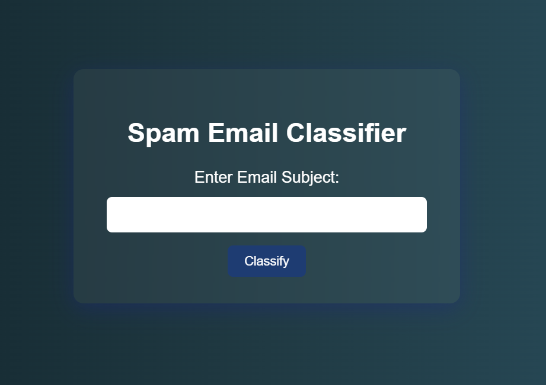

# 📧 Spam Email Classifier

A machine learning web application that classifies whether an email subject line is **Spam** or **Not Spam** using a **Multinomial Naive Bayes** model. The application is built using **Python, Flask, HTML/CSS, and scikit-learn**.

---

## 🧩 Problem Statement

Spam emails have become a major problem for email users, often filling inboxes with unwanted messages and potentially containing phishing links or malicious content.

The goal of this project is to demonstrate how **Machine Learning and Natural Language Processing (NLP)** techniques can be used to automatically identify spam messages and provide a quick classification result.

This application takes an email subject line as input and predicts whether it is **Spam** or **Not Spam** using a trained machine learning model.

---

## 🚀 Project Overview

The **Spam Email Classifier** provides a simple web interface where users can enter an email subject line.

The entered text is processed using a machine learning pipeline consisting of:

- **CountVectorizer** for converting text into numerical features
- **Multinomial Naive Bayes** for classification

After processing the input, the application instantly displays the prediction as either:

> 🛑 **Spam**

or

> ✅ **Not Spam**

The project demonstrates the integration of **Machine Learning with a Flask web application**.

---

## 🛠️ Tech Stack

| Technology | Purpose |
|------------|---------|
| **Python** | Backend development and machine learning |
| **Flask** | Web application framework |
| **HTML** | Web page structure |
| **CSS** | User interface styling |
| **scikit-learn** | Machine learning model and NLP pipeline |
| **Pandas** | Dataset handling and preprocessing |
| **Jupyter Notebook** | Model development and experimentation |

---

## ✨ Features

- 🔍 **Real-time spam detection**
- 📧 Classifies email subject lines as **Spam** or **Not Spam**
- 🧠 Uses **Multinomial Naive Bayes**
- 🔤 Uses **CountVectorizer** for text feature extraction
- 🌐 Flask-based web application
- 🎨 Clean and responsive glass-themed user interface
- 🔄 Uses the **Post/Redirect/Get** pattern to prevent duplicate submissions after refreshing
- 📦 Lightweight and easy to run locally
- 🚀 Can be extended and deployed to cloud platforms

---

## 🧠 Machine Learning Workflow

The application follows a simple NLP and machine learning pipeline:

```text
Email Subject
     ↓
Text Preprocessing
     ↓
CountVectorizer
     ↓
Numerical Feature Extraction
     ↓
Multinomial Naive Bayes
     ↓
Prediction
     ↓
Spam / Not Spam
```

### Model Used

The project uses the **Multinomial Naive Bayes** algorithm, which is commonly used for text classification problems.

The model works with features generated by **CountVectorizer**, which converts the words in the input text into numerical representations that can be processed by the machine learning algorithm.

---

## 📊 Dataset

The project uses a spam dataset containing examples of spam and non-spam messages.

The dataset is stored in:

```text
spam.csv
```

The data is loaded and processed using **Pandas** before being passed through the machine learning pipeline.

---

## 📁 Project Structure

```text
Spam-Email-Classifier/
│
├── spam.csv                  # Dataset
├── app.py                    # Flask application and prediction logic
├── templates/
│   └── index.html            # Web interface
├── README.md                 # Project documentation
├── model.ipynb               # Model development and experimentation
├── Sample.png                # Application preview
└── requirements.txt          # Required Python packages
```

---

## 🖥️ Setup and Installation

### 1. Clone the Repository

```bash
git clone <your-github-repository-url>
cd Spam-Email-Classifier
```

### 2. Create a Virtual Environment

It is recommended to use a virtual environment for the project.

```bash
python -m venv venv
```

Activate the virtual environment.

**Windows:**

```bash
venv\Scripts\activate
```

**Linux / macOS:**

```bash
source venv/bin/activate
```

### 3. Install Dependencies

Install the required Python packages:

```bash
pip install -r requirements.txt
```

### 4. Train / Save the Model

Open the Jupyter Notebook:

```text
model.ipynb
```

Execute the required cells and save the trained model.

### 5. Run the Flask Application

Start the application using:

```bash
python app.py
```

### 6. Open the Application

Once the Flask server starts, open your browser and visit:

```text
http://127.0.0.1:5000
```

You can now enter an email subject line and check whether it is classified as **Spam** or **Not Spam**.

---

## 📸 Application Preview



---

## 🔮 Future Scope

The project can be further improved by implementing:

- 📩 **Full email body analysis** instead of only subject-line classification
- 🧾 Analysis of **email metadata and headers**
- 🧠 Replacing CountVectorizer with **TF-IDF**
- 🤖 Experimenting with **word embeddings and deep learning models**
- 👤 Adding **user authentication**
- 📜 Maintaining a **spam detection history**
- 📊 Adding prediction analytics and statistics
- 🐳 Containerizing the application using **Docker**
- ☁️ Deploying the application using platforms such as **Render or Heroku**
- 📱 Improving mobile responsiveness and UI/UX

---

## 🎯 Learning Outcomes

Through this project, I gained practical experience in:

- Building a **Machine Learning classification model**
- Working with **Natural Language Processing**
- Text feature extraction using **CountVectorizer**
- Implementing **Multinomial Naive Bayes**
- Data preprocessing using **Pandas**
- Integrating machine learning models with **Flask**
- Creating a frontend using **HTML and CSS**
- Connecting frontend input with backend prediction logic
- Building and running a complete ML-based web application

---

## 👨‍💻 Author

**Mathivishnu S**

B.Tech – Information Science and Engineering

Full Stack Python Developer

---

## 📄 License

This project is licensed under the **Apache License 2.0**.

You can view the full license in the `LICENSE` file.

---

## ⭐ Support

If you find this project useful or interesting, consider giving the repository a ⭐ on GitHub.